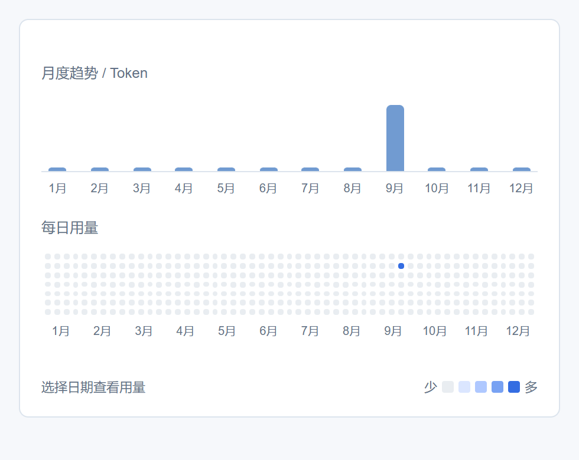
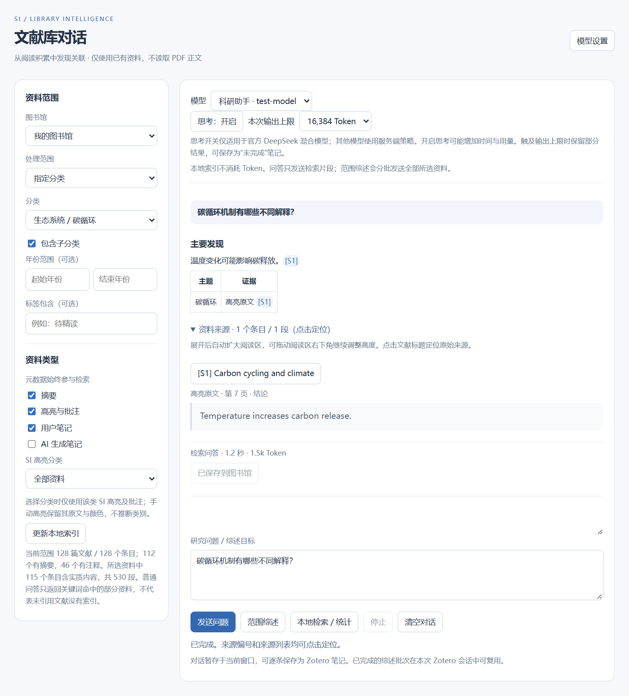

# Zotero Superior Intelligence (SI)

<div align="center">

[](https://www.zotero.org/)
[](LICENSE)
[](#-纯粹开源零门槛人人用得起)
[](#-纯粹开源零门槛人人用得起)
[](https://github.com/yunz1110/Zotero-Superior-Intelligence/releases)
[](https://github.com/yunz1110/Zotero-Superior-Intelligence/pulls)

**专为下一代 Zotero 10 深度定制 · 100% 永久免费开源 · 让每个人都用得起的顶配 AI 学术伴侣**  
零付费门槛 · 无强制订阅 · 极速解析 · 秒级文献总结 · 原文沉浸对话 · 智能重点高亮 · 全库交叉知识库

[English](#english-summary) | [核心特性](#-核心功能矩阵) | [快速安装](#-快速安装指南) | [配置说明](#-配置与使用指南) | [开发构建](#-开发者指南)

</div>

---

> [!IMPORTANT]
> ### 🚀 为什么说这是 Zotero 里更强大、真正人人用得起的 AI 插件？
> 
> 现存的许多 Zotero AI 扩展要么充斥着昂贵的商业会员付费墙、限制使用额度，要么底层架构老旧，面对长篇学术论文、复杂双栏排版时频繁假死卡顿、总结迟缓且严重丢失上下文。
> 
> **Zotero Superior Intelligence (SI)** 专为 **Zotero 10（Gecko ESR 现代平台）** 原生底层架构深度定制，彻底颠覆传统体验：
> - 💚 **100% 永久免费开源，零套路、人人用得起**：彻底打破商业付费墙，**全功能零保留、完全无保留地免费开放**！无需购买任何会员，原生支持免 Token 极速解析，搭配极低廉的 DeepSeek（1 元读上百篇论文）或完全免费的本地 Ollama 私有模型，让每一位学生和科研工作者都能零负担享受顶级学术 AI 生产力。
> - ⚡ **秒级极速解析与文献总结**：优化高速正文提取与流式通信架构，单篇文献极速精读，动态字符打字机实时反馈，告别漫长盲等。
> - 🤖 **深度适配 Zotero 10 原生现代架构**：充分利用 Zotero 10 现代 UI 渲染管线与异步非阻塞调度，界面丝滑无卡顿。
> - 💬 **PDF 原文侧边栏深度精读对话**：随读随问，支持大上下文学术长文研读、回答就地在线编辑润色与一键沉淀为独立笔记。
> - 🖋️ **学术文献智能定位高亮**：全自动识别核心结论、实验方法与创新机制，精准在 PDF 原文生成矢量色彩高亮批注。
> - 📚 **全库知识库联动检索与跨篇对比**：离线倒排索引引擎，提出研究问题即可跨全库检索多篇文献，生成对比分析并附带精确引文溯源卡片。
> - 🔄 **批量容错队列与多模型自由轮换**：支持同时配置 DeepSeek、OpenAI、Claude、本地 Ollama 多套服务商并一键切换，批量处理支持单篇失败隔离与断点续提。
> - 🧮 **原生 KaTeX 完整数学公式支持**：内置学术级公式排版，$\Delta T$、$R^2$、$\beta$ 等复杂学术公式完美展示。

---

## ✨ 核心功能矩阵

### 1. 💚 纯粹开源零门槛，人人用得起的真正生产力
- **零商业付费墙 (Zero Paywall)**：没有任何隐藏收费，没有 VIP/Pro 权限限制，代码 100% 透明开源。
- **极致平民的使用成本**：支持免 Token 轻量解析；兼容超高性价比大模型（如 DeepSeek，百万 Tokens 仅需 1~2 元，精读一篇顶会论文不到 1 分钱），更支持通过 Ollama / vLLM / LocalAI 零成本本地离线运行，彻底实现学术自由。

### 2. ⚡ 极速正文解析与秒级长文总结
- **高速流式处理**：告别传统插件长达数十秒的转圈假死。采用会话级内存缓存与流式打字机机制，分析进度实时反馈，秒级呈现学术洞见。
- **高保真结构化支撑**：底层融合极速文本提取与高精度结构化引擎（支持可选的 MinerU 免 Token 极速模式与精准解析模式），双栏排版、三线表格与学术公式均能高保真还原。
- **自动化成果沉淀**：解析总结完成后，自动为条目生成排版优美的 Markdown 子笔记，并自动追加索引标签。

### 3. 💬 PDF 原文侧边栏沉浸式研读助手
- **原生侧边栏无缝集成**：内嵌于 Zotero 10 PDF 阅读器右侧工具抽屉，边读原文边进行深度学术互动。
- **学术快捷指令**：预置“核心贡献总结”、“技术方法详解”、“实验局限剖析”、“核心结论提炼”等常用科研指令。
- **回答在线编辑与复制**：生成的学术回答支持**就地编辑修改**与**一键复制**，研究者二次润色后可直接一键同步至文献笔记。

### 4. 🖋️ 学术文献智能定位高亮 (Auto-Highlight)
- **智能要点抽取**：AI 自动研读并识别原文中的“研究结论”、“实验方法”、“创新机制”等学术核心要点。
- **真实坐标矢量高亮**：根据 PDF 页面字符坐标流，自动在 PDF 原文中创建语义色彩编码的高亮批注，告别繁重的手工划重点。

### 5. 📚 全库文献知识库与跨篇综合问答
- **本地知识索引构建**：离线提取个人文献库的所有元数据、摘要与关联笔记，构建结构化知识检索索引。
- **跨文献交叉对话**：针对一个综合性课题向全库提问，AI 跨多篇文献交叉检索提取事实，输出结构化综述并附带可点击跳转的**引文溯源卡片**。

### 6. 🤖 多大模型多场景秒级切换 (Multi-Profiles)
- **主流服务商全覆盖**：原生支持 **DeepSeek**（`deepseek-flash`, `deepseek-chat`）、**OpenAI**（GPT-4o, GPT-4o-mini）、**Anthropic Claude**，以及 **Ollama / vLLM** 本地私有化部署。
- **多场景独立配置**：支持保存多个独立的配置卡片（如“快读模型”、“深度推理模型”、“英文润色模型”），工作台中一键秒切。
- **Token 消耗精准计量**：实时统计每个模型调用的 Prompt Tokens、Completion Tokens 及费用消耗，科研预算一目了然。

### 7. 🔄 批量队列调度与中断保护 (Batch Processing)
- **串行异步队列**：支持多选数十篇文献一键批量解析与总结。
- **失败隔离机制**：单篇文献因网络超时或异常不会阻断后续任务，支持中途安全暂停与断点续提。

---

## 🖼️ 界面预览

| 科研工作台与多任务管理 | PDF 阅读器侧边栏对话 |
| :---: | :---: |
|  |  |

> 提示：可在浏览器中直接打开 `docs/ui-preview/*.html` 查看无需 Zotero 运行时的完整界面原型。

---

## 🚀 快速安装指南

### 方式一：直接安装官方预编译包（推荐）

1. 前往本仓库 [Releases](https://github.com/yunz1110/Zotero-Superior-Intelligence/releases) 页面，或在 `dist/` 目录中下载最新版安装包：
   - 📥 **`zotero-superior-intelligence-1.0.0.xpi`**
2. 启动 **Zotero**（专为 Zotero 10 深度优化，亦向下兼容 Zotero 7.0 及以上版本）。
3. 点击顶部菜单栏：**工具 (Tools)** -> **插件 (Add-ons / Plugins)**。
4. 将下载的 `.xpi` 文件直接**拖入插件窗口**（或点击右上角齿轮图标选择 `Install Add-on From File...`）。
5. 提示安装成功后，重启 Zotero 即可开启全新体验。

### 方式二：从源码打包构建

```bash
# 1. 克隆代码仓库
git clone https://github.com/yunz1110/Zotero-Superior-Intelligence.git
cd Zotero-Superior-Intelligence

# 2. 执行打包脚本
python build_xpi.py
# 或使用 npm
npm run build

# 3. 生成的安装包位于 dist/ 目录：
# dist/zotero-superior-intelligence-1.0.0.xpi
```

---

## ⚙️ 配置与使用指南

### 1. 打开插件首选项
在 Zotero 主界面点击：**编辑 (Edit)** -> **首选项 (Preferences)** -> 选择 **Superior Intelligence (SI)** 标签页。

### 2. 配置大语言模型 (LLM)
- 选择服务商（如 DeepSeek、OpenAI、Claude 或 Custom/Ollama）。
- 填写 API Base（如 `https://api.deepseek.com/v1`）与 API Key。
- 选择模型名称（推荐速度快、成本极低的 `deepseek-flash`）。
- 点击 **测试大模型连接** 确保网络与授权正常。

### 3. 文档高保真解析配置（可选）
- **模式选择**：
  - **极速免 Token 模式 (Agent)**：开箱即用，无需配置 Token 即可处理常规论文。
  - **高精度模式 (Token 授权)**：填入 MinerU 授权 Token，支持处理超长篇专著与扫描件。

### 4. 日常高频操作
- **右键极速精读**：在文献列表选中条目，右击选择 **🤖 学术方法与核心贡献精读** 或 **📄 提取全文结构化笔记**。
- **阅读器侧边栏研读**：双击打开 PDF，在右侧工具栏点击 **SI 对话** 展开交互侧边栏，随读随问。
- **全库文献检索**：点击顶部工具栏 **SI 知识库** 图标，跨文献检索提问与生成综述。

---

## 🛠️ 项目工程结构

```
zotero-superior-intelligence/
├── README.md                  # 项目开源主页与使用指南
├── LICENSE                    # AGPL-3.0 开源协议
├── package.json               # 项目元数据与脚本入口
├── build_xpi.py               # 核心构建与 XPI 自动化打包工具
├── PROJECT_ARCHITECTURE.md    # 顶层架构规范与数据流设计
├── EXPERIMENT_LOG.md          # 详细研发、实验与迭代日志
├── .github/
│   └── workflows/build.yml    # GitHub Actions 自动化持续集成与 Release
├── plugin_src/                # 插件完整核心源码
│   ├── manifest.json          # Zotero 10 扩展清单定义
│   ├── bootstrap.js           # 扩展生命周期管理入口
│   ├── chrome.manifest        # Gecko chrome 资源协议注册
│   ├── prefs.js               # 默认参数首选项
│   ├── chrome/content/
│   │   ├── dashboard.xhtml    # 科研工作台界面
│   │   ├── library.xhtml      # 全库检索问答界面
│   │   ├── preferences.xhtml  # 插件首选项面板
│   │   ├── scripts/           # 业务逻辑与客户端实现
│   │   ├── styles/            # KaTeX 数学公式渲染库与样式
│   │   └── icons/             # 界面矢量与标清图标
│   └── locale/                # 多语言本地化（zh-CN, en-US）
├── tests/                     # 自动化端到端与单元测试套件
│   ├── TESTS_CATALOG.md       # 测试目录全景索引
│   ├── smoke.js               # 核心冒烟测试
│   └── ...                    # 各功能单元测试脚本
├── docs/                      # 架构规范与开发文档
│   ├── DOCS_CATALOG.md        # 文档目录索引
│   ├── MINERU_API_SPEC.md     # 接口对接协议规范
│   ├── preview_ui.py          # 独立浏览器 UI 预览生成工具
│   └── ui-preview/            # 离线预览与截图资产
└── dist/                      # 分发产物目录
    ├── DIST_CATALOG.md        # 分发目录规范说明
    ├── zotero-superior-intelligence-1.0.0.xpi  # 最新发布包
    └── archive/               # 历史安装包归档子目录
```

---

## 🧪 测试套件运行

本项目内置完整的无头测试套件，在离线 Mock 环境下校验全部业务逻辑与安全脱敏机制：

```bash
# 执行核心冒烟测试
node tests/smoke.js

# 执行全部测试套件
npm run test:all
```

---

## <a id="english-summary"></a>🌐 English Summary

**Zotero Superior Intelligence (SI)** is a 100% free and open-source AI literature copilot tailored for **Zotero 10** (and compatible with Zotero 7). Built with **zero paywalls and no subscriptions**, it is designed to be affordable and accessible to every student and researcher worldwide.

### Key Highlights:
- 💚 **100% Free & Open-Source**: Zero paywalls, no mandatory subscriptions. Works seamlessly with ultra-cheap DeepSeek tokens or completely free local Ollama models.
- ⚡ **Lightning-Fast Paper Synthesis**: Real-time streaming response, instant insight extraction, zero UI freezing.
- 🎯 **Tailored for Zotero 10**: Deep integration with Gecko ESR modern architecture and asynchronous rendering pipelines.
- 💬 **Interactive PDF Reader Chat**: Context-aware sidebar conversation, on-the-fly editable answers, and one-click note saving.
- 🖋️ **Intelligent Scholarly Auto-Highlighting**: Automatic detection and coordinate-based PDF annotation of key findings, methods, and mechanisms.
- 📚 **Library-Wide Cross-Paper Knowledge Base**: Local inverted indexing, comparative synthesis, and precise citation cards.
- 🤖 **Multi-Provider LLM Profiles**: Instant switching between DeepSeek, OpenAI, Claude, and local Ollama models with token cost tracking.
- 🧮 **Native KaTeX Rendering**: Academic-grade mathematical equation display.

---

## 📄 开源许可证 (License)

本项目基于 [GNU Affero General Public License v3.0 (AGPL-3.0)](LICENSE) 协议开源。

## 🤝 鸣谢与生态

- [Zotero](https://www.zotero.org/) - 现代开源文献管理软件
- [OpenDataLab MinerU](https://github.com/opendatalab/MinerU) - 高质量数据提取工具
- [KaTeX](https://katex.org/) - 高性能 Web 数学公式渲染引擎
